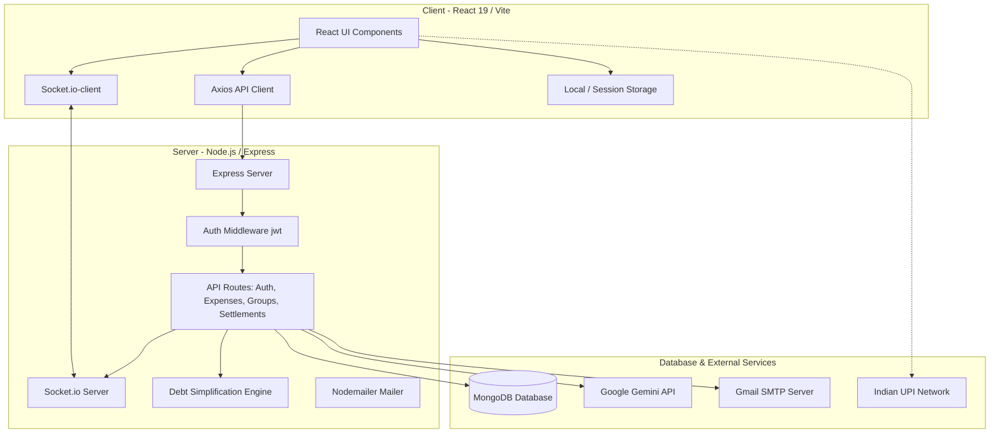

# Settl Technical Project Documentation 💸

Settl is a premium, modern MERN-stack bill-sharing and expense-splitting application. It is tailored for peer-to-peer debt management, transaction simplification, and direct Indian UPI payment facilitation.

---

## 🏛️ High-Level System Architecture

Settl is built on a modern MERN stack. Below is a structural flow of how clients interact with the Express API gateway, MongoDB database, real-time WebSocket connection, and external services (Google Gemini AI, SMTP Mail, UPI apps).



---

## 📂 Project Directory Structure

```text
Settl/
├── backend/                        # Node.js Express server backend
│   ├── src/
│   │   ├── config/                 # Configurations (db.js)
│   │   ├── middleware/             # Express middlewares (auth.js JWT validator)
│   │   ├── models/                 # Mongoose schemas (User, Group, Expense, Settlement, ActivityLog)
│   │   ├── routes/                 # REST endpoints (auth, expenses, groups, settlements)
│   │   ├── utils/                  # Core helpers (debtSimplify algorithm, emailService transporter)
│   │   └── socket.js               # Socket.io connection and room triggers
│   ├── server.js                   # Application server setup and socket integration
│   └── start.js                    # Server dev launcher
├── frontend/                       # Vite + React 19 Client
│   ├── src/
│   │   ├── api/                    # Axios API configuration & session interceptors (axios.js)
│   │   ├── components/             # Reusable UI controls (Navbar, UPIPaymentModal, GoogleLoginButton)
│   │   ├── context/                # Global React contexts (AuthContext, NotificationContext)
│   │   ├── pages/                  # Views (Dashboard, GroupDetail, Login, Register, SettleUp, VerifyEmail)
│   │   ├── App.jsx                 # Client router routes & auth guards
│   │   └── main.jsx                # Application root mount
│   ├── vite.config.js              # Vite compiler configuration
│   └── vercel.json                 # Vercel SPA deploy config
└── README.md                       # High-level repository readme
```

---

## 💾 Database Schemas (Mongoose Models)

Settl uses five main collections in MongoDB, structured as follows:

### 1. User Schema (`User.js`)
Stores user profiles, credential hashes, UPI details, and email verification status.
* `name` (String, required, trimmed)
* `email` (String, required, unique, lowercase)
* `password` (String, required)
* `upiId` (String, default: `""`)
* `isEmailVerified` (Boolean, default: `false`)
* `emailVerificationToken` (String, default: `null`)
* `emailVerificationExpires` (Date, default: `null`)
* `timestamps` (Created at / Updated at)

### 2. Group Schema (`Group.js`)
Represents an expense-splitting group with membership roles.
* `name` (String, required, trimmed)
* `description` (String, default: `""`)
* `members`: Array of objects:
  - `user` (ObjectId ref `"User"`)
  - `role` (String, enum: `["admin", "member"]`, default: `"member"`)
* `createdBy` (ObjectId ref `"User"`, required)
* `currency` (String, default: `"INR"`)
* `timestamps` (Created at / Updated at)

### 3. Expense Schema (`Expense.js`)
Tracks individual payments made by a user on behalf of split members.
* `description` (String, required, trimmed)
* `amount` (Number, required)
* `paidBy` (ObjectId ref `"User"`, required)
* `group` (ObjectId ref `"Group"`, required)
* `splits`: Array of objects:
  - `user` (ObjectId ref `"User"`)
  - `amount` (Number)
  - `paid` (Boolean, default: `false`)
* `splitType` (String, enum: `["equal", "exact", "percentage"]`, default: `"equal"`)
* `category` (String, enum: `["food", "travel", "shopping", "rent", "entertainment", "fuel", "groceries", "medical", "other"]`, default: `"other"`)
* `timestamps` (Created at / Updated at)

### 4. Settlement Schema (`Settlement.js`)
Tracks the status of peer-to-peer transactions between group members.
* `group` (ObjectId ref `"Group"`, required)
* `from` (ObjectId ref `"User"`, required)
* `to` (ObjectId ref `"User"`, required)
* `amount` (Number, required)
* `status` (String, enum: `["pending", "confirmed"]`, default: `"pending"`)
  * `pending`: Payer marked as paid, waiting for receiver to confirm.
  * `confirmed`: Receiver confirmed payment receipt, reducing remaining debt.
* `timestamps` (Created at / Updated at)

### 5. ActivityLog Schema (`ActivityLog.js`)
Keeps a persistent historical log of group activities.
* `group` (ObjectId ref `"Group"`, required, indexed)
* `actor` (ObjectId ref `"User"`, required)
* `type` (String, required, enum: `["expense_added", "expense_deleted", "settlement_requested", "settlement_confirmed", "settlement_disputed", "evidence_submitted", "dispute_resolved", "dispute_rejected", "settlement_rejected", "member_added", "member_removed", "member_left", "group_created"]`)
* `meta` (Mixed, default: `{}`)
* `timestamps` (Created at)

---

## 🧮 Debt Simplification Algorithm

The core technical intelligence of Settl lies in `debtSimplify.js`. Rather than resolving every individual debt transaction, it reduces complex networks of IOUs to the mathematically minimum number of transactions using a **Greedy Net Balance Matching** approach.

### Calculation Method:
1. **Net Balances**: Compute the net balance of each user within a group.
   $$\text{Balance}(U) = \sum \text{Paid Expenses by } U - \sum \text{Share of Expenses for } U$$
2. **Settlements Adjustment**: Subtract any confirmed settlements (receiver verified).
3. **Partitioning**: Separate users into:
   * **Creditors**: Net positive balance (owed money).
   * **Debtors**: Net negative balance (owes money).
4. **Greedy Matching**: 
   * Sort both lists in descending order of absolute values.
   * Match the largest debtor with the largest creditor.
   * Create a transaction of $\text{Settle Amount} = \min(\text{Debtor Owed}, \text{Creditor Owed})$.
   * Deduct this settle amount from both users' balances.
   * If a balance drops to 0, advance to the next user in that list.
   * Repeat until all balances are fully matched.

### Reduction Example:
For a group of 4 people:
```text
A paid ₹300, B paid ₹100, C paid ₹0, D paid ₹0. (Total bill: ₹400. Share per person: ₹100)
Balances initially: 
  A: +₹200 (Creditor)
  B:  ₹0
  C: -₹100 (Debtor)
  D: -₹100 (Debtor)

Simplified Transactions generated:
  - C pays ₹100 to A
  - D pays ₹100 to A
(Total of 2 payments instead of multiple smaller sub-transfers)
```

---

## 🔗 REST API Endpoint Specifications

All endpoints are prefixed with `/api` and require a JSON Web Token inside the `Authorization` header (`Bearer <token>`) unless marked as **[Public]**.

### Authentication Routes (`/api/auth`)
* `POST /register` [Public]: Sign up a new user; creates account and dispatches verification email.
* `POST /login` [Public]: Authenticate with email/password; returns JWT and user metadata.
* `POST /google` [Public]: Google OAuth JWT verification; issues a valid application session token.
* `GET /verify-email` [Public]: Handles email validation using a secure query token.
* `PUT /profile` [Protected]: Update user profile data (name, email, upiId).
* `PUT /change-password` [Protected]: Overwrite existing account credentials securely.
* `POST /resend-verification` [Protected]: Dispatches a fresh SMTP verification link.

### Expense Routes (`/api/expenses`)
* `POST /` [Protected]: Record a new expense. Computes individual splits server-side. Broadcasts `expense_added` via Socket.io.
* `GET /group/:groupId` [Protected]: Retrieve a group's expenses with month-based pagination support.
* `DELETE /:id` [Protected]: Delete an expense, updating group balances and logs.

### Group Routes (`/api/groups`)
* `POST /` [Protected]: Create a new split group. The creator is assigned the `admin` role.
* `GET /` [Protected]: Get a listing of all groups of which the authenticated user is a member.
* `GET /:id` [Protected]: Get full details of a specific group, including its member list.
* `POST /:id/members` [Protected]: Add a new user to a group via their registered email address.
* `DELETE /:id/members/:userId` [Protected]: Remove a member from the group, or allow a member to leave.
* `DELETE /:id` [Protected]: Hard delete a group (admin only).

### Settlement Routes (`/api/settlements`)
* `GET /simplify/:groupId` [Protected]: Run the debt simplification algorithm on the group's net balances. Returns simplified transactions alongside queues of `confirmedSettlements` and `pendingRequests`.
* `POST /settle` [Protected]: Initiate a settlement. The payer flags a debt as settled. Creates a `pending` settlement record.
* `POST /confirm` [Protected]: Confirm a settlement (receiver only). Updates status to `confirmed`.
* `DELETE /settle` [Protected]: Cancel a pending settlement request (payer only).
* `POST /reject` [Protected]: Decline a pending settlement request (receiver only).
* `GET /group/:groupId/activity` [Protected]: Retrieve paged activity logs for a group.

---

## ⚡ WebSocket Events & Synchronization

Settl implements real-time visual updates via `Socket.io`. Clients join WebSocket rooms segregated by `groupId`. When actions occur in the REST API, the server triggers events to the group room, notifying all logged-in members.

### WebSocket Connection Lifecycle:
1. Client connects via `socket.io-client` on app mount (if user token is present).
2. The client fetches user groups and issues a `join_group` socket emit for each group ID.
3. The server places the socket connection inside the corresponding rooms.
4. When a user creates/removes an expense or files a settlement request, the API fires socket broadcasts.
5. The React `NotificationContext` catches these events and triggers micro-animations, audio cues, or toast alerts.

### Event Protocol:
| Event Name | Emitter | Payload | Receiver Handler / Effect |
| :--- | :--- | :--- | :--- |
| `join_group` | Client | `groupId` | Joins socket room `groupId` on server |
| `leave_group` | Client | `groupId` | Leaves socket room `groupId` |
| `expense_added` | Server | `Expense` object | Adds item to feed, updates balances |
| `settlement_requested` | Server | `Settlement` object | Notifies receiver of pending payment |
| `settlement_done` | Server | `Settlement` object | Notifies payer of confirmation, updates debts |
| `settlement_undone` | Server | `{ fromId, toId }` | Removes pending request, reverts UI |
| `settlement_rejected` | Server | `Settlement` object | Rejects request, displays rejection toast |

---

## 💳 UPI Payment Flow & QR System

Settl offers a frictionless peer-to-peer payment flow that bypasses intermediate payment processors entirely.

```text
             [Settle Up Screen]
                     │
          Does device support UPI?
         ┌───────────┴───────────┐
        YES                     NO
         │                       │
 [Mobile Deep Link]      [Desktop QR Code]
  - Auto-open UPI apps    - Generates dynamic QR
  - Target VPA prefilled  - User scans with mobile
  - Amount locked in      - One-click copy backup
```

### 1. Mobile Deep Linking
When clicking "Pay" on mobile, the client builds a UPI deep-link URI:
```text
upi://pay?pa=receiverVpa@okaxis&pn=ReceiverName&am=Amount&cu=INR&tn=Settl%20Payment
```
Triggering this link prompts iOS/Android to open compatible apps (GPay, PhonePe, Paytm, BHIM) with pre-filled payment fields.

### 2. Desktop QR Code Generation
On desktop, `qrcode.react` renders the UPI URI as a high-contrast QR code. The user opens their phone's camera or UPI app, scans the code, and completes the transfer directly.

### 3. Verification Queue
* Once transferred, the payer clicks **"I've Paid"**.
* The settlement status transitions to `pending`.
* The receiver gets a notification.
* Only when the receiver clicks **"Confirm"** is the transaction finalized in the DB.

---

## 🔐 Session Management & Security

* **Token Interception**: The Axios instance automatically intercepts outgoing HTTP requests, fetching the JWT from `localStorage` and injecting it as a Bearer authorization token.
* **Graceful Session Eviction**: An Axios response interceptor monitors all responses. If any request returns a `401 Unauthorized` (indicating the token expired, was modified, or revoked):
  1. It evicts user data from `localStorage`.
  2. Flags a session expiry parameter (`settl_session_expired`).
  3. Redirects the browser window to `/login`.
  4. Triggers a red error banner toast.
* **Email Verification Token Security**: Verification tokens are generated using cryptographically secure random bytes, expiring exactly 48 hours after generation.

---

## 🧠 AI Financial Insights Integration

To encourage healthy budgeting, Settl integrates Google Gemini API to generate personalized financial tips.

1. **API Interaction**: On login, the dashboard queries the Google Gemini API (using the model `gemini-1.5-flash`).
2. **Contextual Instruction**: The request includes a specific system prompt requiring 10 financial tips tailored for young Indian professionals, spanning budgeting rules (e.g., 50/30/20), investment compounding (SIPs, index funds), debt safety, tax saving (80C, PPF, ELSS), and social expense etiquette.
3. **Session Cache**: Tips are validated and cached inside the client's `sessionStorage`. Subsequent dashboard navigation loads the tips instantly without spamming API limits.
4. **Fallback Mechanism**: If the client is missing a Gemini key or the API is unreachable, the system falls back to a pre-defined array of tips, keeping the user interface clean and operational.

---

## 🚀 Local Development Setup

### Prerequisites
* **Node.js** v18+ & **npm** v9+
* **MongoDB** (Local instance or MongoDB Atlas URI)
* A **Google AI Studio** Gemini API Key
* A **Gmail** account with an App Password (SMTP relay setup)

### 1. Environment Variable Setup

Create `backend/.env` with the following variables:
```env
PORT=5000
MONGO_URI=mongodb+srv://<username>:<password>@cluster.mongodb.net/settl
JWT_SECRET=your_jwt_signing_key_secret
GMAIL_USER=your_gmail_address@gmail.com
GMAIL_APP_PASSWORD=your_16_character_app_password
FRONTEND_URL=http://localhost:5173
GEMINI_API_KEY=your_gemini_api_key
```

Create `frontend/.env` with:
```env
VITE_API_URL=http://localhost:5000
VITE_GEMINI_API_KEY=your_gemini_api_key
VITE_GOOGLE_CLIENT_ID=your_google_client_id_for_oauth
```

### 2. Dependency Installation

```bash
# Install backend packages
cd backend
npm install

# Install frontend packages
cd ../frontend
npm install
```

### 3. Launching in Development

```bash
# Start backend (auto-restarts via nodemon)
cd backend
npm run dev

# Start frontend (Vite dev server)
cd ../frontend
npm run dev
```
Once run, navigate your browser to `http://localhost:5173`.
