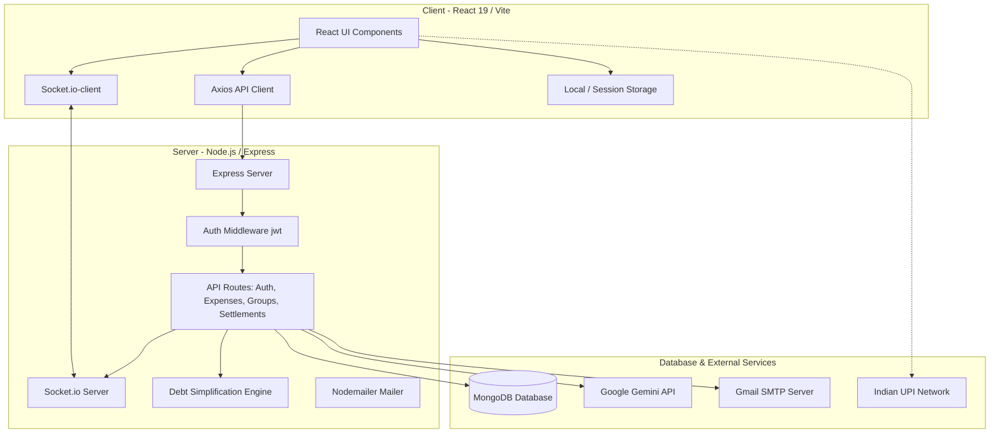

# Settl. 💸

Settl is a premium, modern MERN-stack bill-sharing, expense-splitting, and debt-simplification application designed for friends, flatmates, and travel groups. It simplifies the process of tracking group expenses, managing shared bills, and settling balances directly using Indian UPI IDs, dynamic QR codes, mobile payment deep links, and Google Gemini AI insights.

---

## 🏛️ High-Level System Architecture

Settl is built on a modern MERN stack. Below is a structural flow of how clients interact with the Express API gateway, MongoDB database, real-time WebSocket connection, and external services (Google Gemini AI, SMTP Mail, UPI apps).



---

## 🚀 Key Highlights & Capabilities

### 🎨 Visual Redesign & Presentation
- **Futuristic Aesthetics**: A premium split-screen dashboard layout with a dark-mode color palette, ambient gradient glows, and delicate grid backdrops.
- **Interactive Visualizer**: Features a vector representation of mathematical debt simplification using glowing SVG curves, animated flows, and glowing avatar badges.
- **Fluid Layout**: Translucent rounded scrollbars (`custom-scrollbar` styles) and disabled horizontal scrollbars to optimize the viewport for standard browser zoom levels.

### 💸 Debt Simplification Algorithm
The core technical intelligence of Settl lies in its greedy net balance matching approach. Rather than resolving every individual debt transaction, it reduces complex networks of IOUs to the mathematically minimum number of transactions.
1. **Net Balances**: Compute the net balance of each user within a group.
   $$\text{Balance}(U) = \sum \text{Paid Expenses by } U - \sum \text{Share of Expenses for } U$$
2. **Settlements Adjustment**: Subtract any confirmed settlements (receiver verified).
3. **Partitioning & Greedy Matching**: Separate users into Creditors (net positive) and Debtors (net negative). Sort both lists in descending order of absolute values, matching the largest debtor with the largest creditor. Create a transaction of $\text{Settle Amount} = \min(\text{Debtor Owed}, \text{Creditor Owed})$ and deduct until all balances are fully matched.

### 💳 Frictionless P2P UPI Payments
- **Mobile Deep Linking**: When clicking "Pay" on mobile, the client builds a UPI deep-link URI:
  ```text
  upi://pay?pa=receiverVpa@okaxis&pn=ReceiverName&am=Amount&cu=INR&tn=Settl%20Payment
  ```
  This prompts iOS/Android to open compatible apps (GPay, PhonePe, Paytm, BHIM) with pre-filled payment fields.
- **Desktop QR Code**: On desktop, `qrcode.react` renders the UPI URI as a high-contrast QR code. The user opens their phone's camera or UPI app to scan and pay.
- **Verification Shield**: Implements a responsive two-column grid confirmation modal (`UpiConfirmModal`) that blocks registration and profile saves until the user double-checks and checkbox-authorizes their entered UPI ID to prevent lost payments.
- **Partial Settlements**: Allows users to make partial settlements. The app automatically calculates the remaining balance, generates a partial UPI payment request, and updates the simplified debt ledger upon recipient confirmation.

### ⚡ WebSocket Events & Real-Time Sync
Settl implements real-time updates via `Socket.io`. Clients join WebSocket rooms segregated by `groupId`. When actions occur in the REST API, the server triggers events to the group room, notifying all logged-in members.
- The React `NotificationContext` catches these events and triggers micro-animations, audio cues, or toast alerts.

### 🎯 AI Trust Score & Financial Mentor
- **Weighted Core Dimensions**: The trust engine computes a user score out of 100 based on three distinct behavioral aspects:
  - *Repayment Reliability* (50% weight): Measures how quickly a user pays back (Average Initiative Hours) and how reliably they follow through.
  - *Upfront Contribution* (35% weight): Tracks the ratio of upfront spending fronted by the user relative to their total involved share.
  - *Spending Consistency* (15% weight): Measures month-to-month variation in personal share totals, favoring predictable patterns.
- **Dynamic Renormalization Gating**: Each dimension requires a minimum activity baseline (e.g., at least 2 settlements for reliability, 3 expenses for contribution, and 3 active months for consistency). To prevent penalizing new users due to missing history, dimensions with insufficient data are skipped, and weights are dynamically renormalized across the active qualifying factors.
- **Post-Weighted Fraud Penalty**: Settlement claims rejected/disputed by receivers act as a negative fraud/reliability signal. Instead of being blended into the weighted dimensions, a separate, disproportionate penalty is calculated using a diminishing returns formula and deducted directly from the final score (capping at a 50-point maximum deduction).
- **AI Financial Mentor Panel**: Rather than exposing internal numeric sub-metrics or signal names, a dedicated Gemini integration provides natural-language coaching. The prompt uses raw behavioral facts (exact ₹ values fronted, days-to-settle, settlement counts, and rejection logs) to draft actionable tips and constructive advice.
- **Trend Tracking & What-If Projection**: The Mentor tracks historical progress by saving and comparing scores since the last calculation to present trends (e.g., score delta). It also highlights the user's weakest score dimension and displays a "what-if" projection showing the exact score impact if the user follows the top recommendation.
- **Separation of Services**: This system operates independently of the Dashboard "Financial Tips" feature, utilizing distinct Gemini API integrations and prompts optimized for secure, fact-based behavioral coaching.

### 🧠 AI Financial Tips (Dashboard)
- **Google Gemini Integration**: On login, the dashboard queries the Google Gemini API (using the model `gemini-2.5-flash` with `gemini-3.5-flash` fallback).
- **Contextual Instruction**: The prompt requests 10 financial tips tailored for young Indian professionals, spanning budgeting rules (e.g., 50/30/20), investment compounding (SIPs, index funds), debt safety, tax saving (80C, PPF, ELSS), and social expense etiquette.
- **Session Cache**: Tips are validated and cached inside the client's `sessionStorage` to avoid spamming API limits. A pre-defined local array of tips serves as a fallback.

### 🛡️ Session Management & Security
- **HTTP-Only Cookies**: Application JWT tokens are stored securely in HTTP-only cookies, safeguarding them from Cross-Site Scripting (XSS) attacks. The same cookie handles validation for REST endpoints and Socket.IO connections.
- **Graceful Session Eviction**: An Axios response interceptor monitors all responses. If any request returns a `401 Unauthorized`, it evicts user data from `localStorage`, flags session expiry, redirects to `/login`, and triggers an error banner toast.
- **Email Verification Guard**: Requires users to complete email verification via high-fidelity, secure Nodemailer SMTP tokens before accessing group expenses, settlements, messages, or real-time websocket rooms.
- **Production Authentication & Key Scope**: In production environments, Google OAuth is the sole supported authentication path (bypassing any development mock logins). Crucially, while the Dashboard Tips feature makes client-side requests using a client-side API key (`VITE_GEMINI_API_KEY`), the Gemini API keys for the Trust Score & AI Financial Mentor features are restricted server-side only and never exposed to the client.

---

## 🛠️ Tech Stack Reference

| Layer | Technologies |
| --- | --- |
| **Frontend** | React 19, Vite, Tailwind CSS, Axios, Socket.IO Client, QR Code SVG |
| **Backend** | Node.js, Express, Socket.IO Server |
| **Database** | MongoDB Atlas, Mongoose ODM |
| **Security & Auth** | HTTP-Only JWT Cookie, bcryptjs, Google OAuth 2.0 |
| **Integrations** | Google Gemini API (`gemini-2.5-flash` / `gemini-3.5-flash` fallback), Nodemailer / Gmail SMTP, UPI deep link protocols |

---

## 📂 Project Directory Structure

```text
Settl/
├── backend/                        # Node.js Express server backend
│   ├── src/
│   │   ├── config/                 # Configurations (db.js)
│   │   ├── middleware/             # Express middlewares (auth.js JWT validator)
│   │   ├── models/                 # Mongoose schemas (User, Group, Expense, Settlement, ActivityLog)
│   │   ├── routes/                 # REST endpoints (auth, expenses, groups, settlements)
│   │   ├── utils/                  # Core helpers (debtSimplify algorithm, emailService transporter)
│   │   └── socket.js               # Socket.io connection and room triggers
│   └── server.js                   # Application entry point & WebSockets setup
├── frontend/                       # Vite + React 19 Client
│   ├── src/
│   │   ├── api/                    # Axios API configuration & session interceptors (axios.js)
│   │   ├── components/             # Reusable UI controls (Navbar, UPIPaymentModal, GoogleLoginButton)
│   │   ├── context/                # Global React contexts (AuthContext, NotificationContext)
│   │   ├── pages/                  # Views (Dashboard, GroupDetail, Login, Register, SettleUp, VerifyEmail)
│   │   ├── App.jsx                 # Client router routes & auth guards
│   │   └── main.jsx                # Application root mount
│   ├── vite.config.js              # Vite compiler configuration
│   └── vercel.json                 # Vercel SPA deploy config
└── README.md                       # High-level repository readme
```

---

## 💾 Database Schemas (Mongoose Models)

### 1. User Schema (`User.js`)
Stores user profiles, credential hashes, UPI details, and email verification status.
* `name` (String, required, trimmed)
* `email` (String, required, unique, lowercase)
* `password` (String, required)
* `upiId` (String, default: `""`)
* `isEmailVerified` (Boolean, default: `false`)
* `emailVerificationToken` (String, default: `null`)
* `emailVerificationExpires` (Date, default: `null`)
* `timestamps` (Created at / Updated at)

### 2. Group Schema (`Group.js`)
Represents an expense-splitting group with membership roles.
* `name` (String, required, trimmed)
* `description` (String, default: `""`)
* `members`: Array of objects:
  - `user` (ObjectId ref `"User"`)
  - `role` (String, enum: `["admin", "member"]`, default: `"member"`)
* `createdBy` (ObjectId ref `"User"`, required)
* `currency` (String, default: `"INR"`)
* `timestamps` (Created at / Updated at)

### 3. Expense Schema (`Expense.js`)
Tracks individual payments made by a user on behalf of split members.
* `description` (String, required, trimmed)
* `amount` (Number, required)
* `paidBy` (ObjectId ref `"User"`, required)
* `group` (ObjectId ref `"Group"`, required)
* `splits`: Array of objects:
  - `user` (ObjectId ref `"User"`)
  - `amount` (Number)
  - `paid` (Boolean, default: `false`)
* `splitType` (String, enum: `["equal", "exact", "percentage"]`, default: `"equal"`)
* `category` (String, enum: `["food", "travel", "shopping", "rent", "entertainment", "fuel", "groceries", "medical", "other"]`, default: `"other"`)
* `timestamps` (Created at / Updated at)

### 4. Settlement Schema (`Settlement.js`)
Tracks the status of peer-to-peer transactions between group members.
* `group` (ObjectId ref `"Group"`, required)
* `from` (ObjectId ref `"User"`, required)
* `to` (ObjectId ref `"User"`, required)
* `amount` (Number, required)
* `status` (String, enum: `["pending", "confirmed"]`, default: `"pending"`)
  * `pending`: Payer marked as paid, waiting for receiver to confirm.
  * `confirmed`: Receiver confirmed payment receipt, reducing remaining debt.
* `timestamps` (Created at / Updated at)

### 5. ActivityLog Schema (`ActivityLog.js`)
Keeps a persistent historical log of group activities.
* `group` (ObjectId ref `"Group"`, required, indexed)
* `actor` (ObjectId ref `"User"`, required)
* `type` (String, required, enum: `["expense_added", "expense_deleted", "settlement_requested", "settlement_confirmed", "settlement_disputed", "evidence_submitted", "dispute_resolved", "dispute_rejected", "settlement_rejected", "member_added", "member_removed", "member_left", "group_created"]`)
* `meta` (Mixed, default: `{}`)
* `timestamps` (Created at)

---

## 🔗 REST API Endpoint Specifications

All endpoints are prefixed with `/api` and require a JSON Web Token inside the `Authorization` header (`Bearer <token>`) unless marked as **[Public]**.

### Authentication Routes (`/api/auth`)
* `POST /register` [Public]: Sign up a new user; creates account and dispatches verification email.
* `POST /login` [Public]: Authenticate with email/password; returns JWT and user metadata.
* `POST /google` [Public]: Google OAuth JWT verification; issues a valid application session token.
* `GET /verify-email` [Public]: Handles email validation using a secure query token.
* `PUT /profile` [Protected]: Update user profile data (name, email, upiId).
* `PUT /change-password` [Protected]: Overwrite existing account credentials securely.
* `POST /resend-verification` [Protected]: Dispatches a fresh SMTP verification link.

### Expense Routes (`/api/expenses`)
* `POST /` [Protected]: Record a new expense. Computes splits server-side. Broadcasts `expense_added` via Socket.io.
* `GET /group/:groupId` [Protected]: Retrieve a group's expenses with month-based pagination support.
* `DELETE /:id` [Protected]: Delete an expense, updating group balances and logs.

### Group Routes (`/api/groups`)
* `POST /` [Protected]: Create a new split group. The creator is assigned the `admin` role.
* `GET /` [Protected]: Get a listing of all groups of which the authenticated user is a member.
* `GET /:id` [Protected]: Get full details of a specific group, including its member list.
* `POST /:id/members` [Protected]: Add a new user to a group via their registered email address.
* `DELETE /:id/members/:userId` [Protected]: Remove a member from the group, or allow a member to leave.
* `DELETE /:id` [Protected]: Hard delete a group (admin only).

### Settlement Routes (`/api/settlements`)
* `GET /simplify/:groupId` [Protected]: Run the debt simplification algorithm on the group's net balances. Returns simplified transactions alongside queues of `confirmedSettlements` and `pendingRequests`.
* `POST /settle` [Protected]: Initiate a settlement. The payer flags a debt as settled. Creates a `pending` settlement record.
* `POST /confirm` [Protected]: Confirm a settlement (receiver only). Updates status to `confirmed`.
* `DELETE /settle` [Protected]: Cancel a pending settlement request (payer only).
* `POST /reject` [Protected]: Decline a pending settlement request (receiver only).
* `GET /group/:groupId/activity` [Protected]: Retrieve paged activity logs for a group.

---

## ⚡ WebSocket Event Protocol

| Event Name | Emitter | Payload | Receiver Handler / Effect |
| :--- | :--- | :--- | :--- |
| `join_group` | Client | `groupId` | Joins socket room `groupId` on server |
| `leave_group` | Client | `groupId` | Leaves socket room `groupId` |
| `expense_added` | Server | `Expense` object | Adds item to feed, updates balances |
| `settlement_requested` | Server | `Settlement` object | Notifies receiver of pending payment |
| `settlement_done` | Server | `Settlement` object | Notifies payer of confirmation, updates debts |
| `settlement_undone` | Server | `{ fromId, toId }` | Removes pending request, reverts UI |
| `settlement_rejected` | Server | `Settlement` object | Rejects request, displays rejection toast |

---

## 🚀 Local Development Setup

### Prerequisites
* **Node.js** v18+ & **npm** v9+
* **MongoDB** (Local instance or MongoDB Atlas URI)
* A **Google AI Studio** Gemini API Key (optional for AI insights fallback)
* A **Gmail** account with an **App Password** (for Nodemailer SMTP email verification)
* **Google OAuth Client ID** credentials (required to use Google Sign-In)

### 1. Environment Variable Setup

Create `backend/.env` with the following variables:
```env
PORT=5000
MONGO_URI=mongodb+srv://<username>:<password>@cluster.mongodb.net/settl
JWT_SECRET=your_jwt_signing_key_secret
GMAIL_USER=your_gmail_address@gmail.com
GMAIL_APP_PASSWORD=your_16_character_app_password
FRONTEND_URL=http://localhost:5173
GEMINI_API_KEY=your_gemini_api_key
```

Create `frontend/.env` with:
```env
VITE_API_URL=http://localhost:5000
VITE_GEMINI_API_KEY=your_gemini_api_key
VITE_GOOGLE_CLIENT_ID=your_google_client_id_for_oauth
```

### 2. Dependency Installation

```bash
# Install backend packages
cd backend
npm install

# Install frontend packages
cd ../frontend
npm install
```

### 3. Launching in Development

```bash
# Start backend (auto-restarts via nodemon)
cd backend
npm run dev

# Start frontend (Vite dev server)
cd ../frontend
npm run dev
```
Once run, navigate your browser to `http://localhost:5173`.

---

## 📜 Available Scripts

Run these scripts from their respective directory (`backend` or `frontend`):

| Path | Command | Description |
| --- | --- | --- |
| `backend` | `npm start` | Launches Node server in production |
| `backend` | `npm run dev` | Launches server with nodemon auto-reload |
| `frontend` | `npm run dev` | Starts Vite dev client server |
| `frontend` | `npm run build` | Bundles production asset packages |
| `frontend` | `npm run lint` | Inspects codebase with ESLint |

---

## 🔒 Security Practices
- Keep all `.env` files out of public source code repositories.
- Use secure, multi-character secrets for `JWT_SECRET`.
- Ensure `FRONTEND_URL` is set to the exact deployed origin to prevent unauthorized CORS requests.
- Deploy frontend and backend servers over HTTPS in production to enforce secure HTTP-only cookies.

---

## 📄 License
This project is licensed under the [MIT License](LICENSE).
